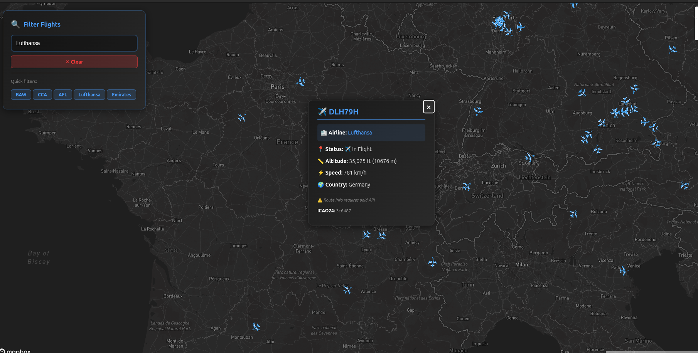

# ✈️ Real-Time Flight Tracker

A full-stack web application that visualizes live air traffic from around the world on an interactive Mapbox map.

### 🔴 Live Demo

**[https://flight-tracker-c2817.web.app/](https://flight-tracker-c2817.web.app/)** 

### 📸 Demo Screenshot



---

## 🗺️ About The Project

This project fetches and displays real-time flight data from the **OpenSky Network**, allowing users to explore global air traffic as it happens. The map dynamically loads new flights as the user pans and zooms, and individual flights can be clicked to reveal more details.

This application is built using a modern, serverless architecture, with a React frontend and a Firebase Functions backend acting as a secure proxy.

## ✨ Core Features

* **Real-Time Data:** Visualizes live flight positions, altitudes, and headings.
* **Interactive Map:** Built with Mapbox GL JS, allowing smooth panning and zooming.
* **Dynamic Loading:** The map view acts as a bounding box. As the user moves the map, only the flights in the current view are fetched from the API.
* **Click Interaction:** Click on any aircraft to see a popup with its callsign, altitude, and unique ID.
* **Dynamic Filtering:** A live filter box allows users to filter aircraft by callsign in real-time (e.g., typing "SWA" will only show Southwest Airlines).
* **Automatic Refresh:** Data automatically refreshes every 15 seconds to show the latest positions.

## 🛠️ Tech Stack

This project is built with a decoupled, full-stack architecture:

* **Frontend:**
    * **[React](https://reactjs.org/)** (with Vite)
    * **[Mapbox GL JS](https://www.mapbox.com/mapbox-gl-js)** for high-performance map rendering.
    * **[Axios](https://axios-http.com/)** for API requests.
* **Backend (Serverless):**
    * **[Firebase Functions](https://firebase.google.com/products/functions)**: A Node.js proxy that securely handles API requests to the OpenSky Network, protecting private API keys.
* **Database:**
    * **[Firebase Firestore](https://firebase.google.com/products/firestore)**: A NoSQL database used to store a static collection of 7,000+ airports (from OpenFlights.org) for future search functionality.
* **Hosting:**
    * **[Firebase Hosting](https://firebase.google.com/products/hosting)**: Deployed the static React build to a global CDN.

---

## 🚀 Getting Started (Running Locally)

To get a local copy up and running, follow these steps.

### Prerequisites

* Node.js (v18 or later)
* `npm`
* A **Mapbox** account (for an access token)
* An **OpenSky Network** account (for a username/password)
* A **Firebase** project (upgraded to the Blaze plan)

### 1. Configure the Frontend (React App)

1.  **Clone the repo:**
    ```bash
    git clone [https://github.com/YOUR_USERNAME/flight-tracker-web.git](https://github.com/YOUR_USERNAME/flight-tracker-web.git)
    cd flight-tracker-web
    ```
2.  **Install frontend dependencies:**
    ```bash
    npm install
    ```
3.  **Create your environment file:**
    * Create a file named `.env` in the root (`flight-tracker-web`) folder.
    * Add your Mapbox access token:
    ```
    VITE_MAPBOX_TOKEN=pk.YOUR_MAPBOX_TOKEN_HERE
    ```
4.  **Update the API URL:**
    * Open `src/App.jsx`.
    * Find the `function_url` variable and replace it with your own deployed function URL (which you will create in the next step).

### 2. Configure the Backend (Firebase)

1.  **Install Firebase tools:**
    ```bash
    npm install -g firebase-tools
    ```
2.  **Initialize Firebase (if you haven't):**
    ```bash
    # (Select your project, choose Functions + Hosting)
    firebase init 
    ```
3.  **Install backend dependencies:**
    ```bash
    cd functions
    npm install
    ```
4.  **Set your OpenSky API keys (Securely):**
    * *(Replace with your OpenSky website login credentials)*
    ```bash
    firebase functions:config:set opensky.user="YOUR_OPENSKY_USER"
    firebase functions:config:set opensky.pass="YOUR_OPENSKY_PASS"
    ```
5.  **Deploy your function:**
    ```bash
    firebase deploy --only functions
    ```
6.  **Deploy your hosting:**
    * First, build the React app:
    ```bash
    # (Make sure you are in the root folder, not /functions)
    npm run build
    ```
    * Then, deploy:
    ```bash
    firebase deploy --only hosting
    ```
    *(⬇️ **Note:** Ensure your `firebase.json` file's `hosting.public` directory is set to `"dist"`!)*

### 3. Run Locally

* Run the frontend development server:
    ```bash
    npm run dev
    ```
* Your app will be live at `http://localhost:5173`.

---

## 🏛️ Project Architecture

This app uses a simple but powerful serverless proxy architecture to protect API keys and manage data flow.

1.  **Real-Time Data Flow:**
    `React (Client)` ➡️ `Firebase Function` ➡️ `OpenSky Network API`
    * The client (browser) sends its map boundaries (bbox) to our Firebase Function.
    * The Firebase Function (server) securely adds the OpenSky credentials and requests data from the OpenSky Network.
    * This prevents the OpenSky username/password from ever being exposed in the browser.

2.  **Static Data (Future):**
    `React (Client)` ➡️ `Firestore Database`
    * The (future) search-by-airport feature will query the `airports` collection in Firestore directly to find airport coordinates.

## 🙏 Acknowledgements

* **Data:** [OpenSky Network](https://opensky-network.org)
* **Data:** [OpenFlights.org](https://openflights.org/data.html)
* **Map:** [Mapbox](https://www.mapbox.com/)
* **Framework:** [React](https://reactjs.org/)
* **Platform:** [Firebase](https://firebase.google.com/)